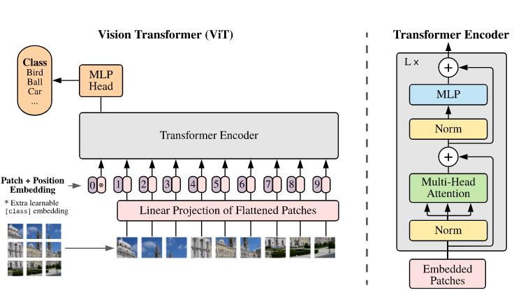
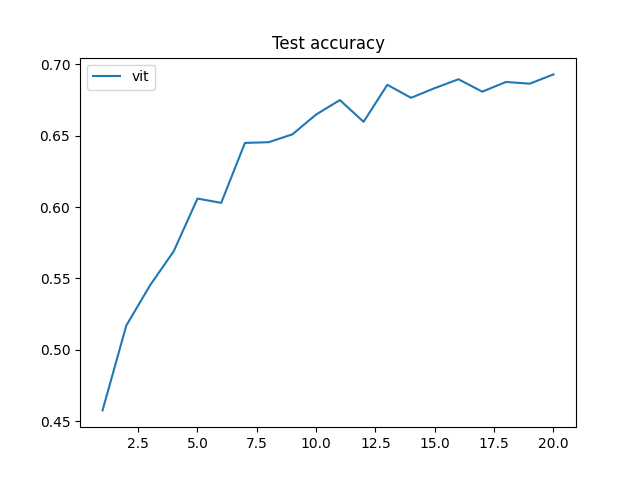

# Vision Transformers
> 站在前人的肩膀上进行了相应的结合与修改。
> 本项目目前参考：
> https://github.com/FrancescoSaverioZuppichini/ViT
> https://github.com/xmu-xiaoma666/External-Attention-pytorch

## 1.Vision Transformer(ViT)
**主干结构：**



**模型结构：**(这里采用四个encoder block)：
```python
----------------------------------------------------------------
        Layer (type)               Output Shape         Param #
================================================================
         Rearrange-1               [-1, 64, 48]               0
            Linear-2              [-1, 64, 192]           9,408
    PatchEmbedding-3              [-1, 65, 192]               0
         LayerNorm-4              [-1, 65, 192]             384
            Linear-5              [-1, 65, 576]         111,168
           Dropout-6            [-1, 3, 65, 65]               0
            Linear-7              [-1, 65, 192]          37,056
SimplifiedScaledDotProductAttention-8              [-1, 65, 192]               0
           Dropout-9              [-1, 65, 192]               0
        LayerNorm-10              [-1, 65, 192]             384
           Linear-11              [-1, 65, 768]         148,224
             GELU-12              [-1, 65, 768]               0
          Dropout-13              [-1, 65, 768]               0
           Linear-14              [-1, 65, 192]         147,648
          Dropout-15              [-1, 65, 192]               0
        LayerNorm-16              [-1, 65, 192]             384
           Linear-17              [-1, 65, 576]         111,168
          Dropout-18            [-1, 3, 65, 65]               0
           Linear-19              [-1, 65, 192]          37,056
SimplifiedScaledDotProductAttention-20              [-1, 65, 192]               0
          Dropout-21              [-1, 65, 192]               0
        LayerNorm-22              [-1, 65, 192]             384
           Linear-23              [-1, 65, 768]         148,224
             GELU-24              [-1, 65, 768]               0
          Dropout-25              [-1, 65, 768]               0
           Linear-26              [-1, 65, 192]         147,648
          Dropout-27              [-1, 65, 192]               0
        LayerNorm-28              [-1, 65, 192]             384
           Linear-29              [-1, 65, 576]         111,168
          Dropout-30            [-1, 3, 65, 65]               0
           Linear-31              [-1, 65, 192]          37,056
SimplifiedScaledDotProductAttention-32              [-1, 65, 192]               0
          Dropout-33              [-1, 65, 192]               0
        LayerNorm-34              [-1, 65, 192]             384
           Linear-35              [-1, 65, 768]         148,224
             GELU-36              [-1, 65, 768]               0
          Dropout-37              [-1, 65, 768]               0
           Linear-38              [-1, 65, 192]         147,648
          Dropout-39              [-1, 65, 192]               0
        LayerNorm-40              [-1, 65, 192]             384
           Linear-41              [-1, 65, 576]         111,168
          Dropout-42            [-1, 3, 65, 65]               0
           Linear-43              [-1, 65, 192]          37,056
SimplifiedScaledDotProductAttention-44              [-1, 65, 192]               0
          Dropout-45              [-1, 65, 192]               0
        LayerNorm-46              [-1, 65, 192]             384
           Linear-47              [-1, 65, 768]         148,224
             GELU-48              [-1, 65, 768]               0
          Dropout-49              [-1, 65, 768]               0
           Linear-50              [-1, 65, 192]         147,648
          Dropout-51              [-1, 65, 192]               0
           Reduce-52                  [-1, 192]               0
        LayerNorm-53                  [-1, 192]             384
           Linear-54                   [-1, 10]           1,930
================================================================
Total params: 1,791,178
Trainable params: 1,791,178
Non-trainable params: 0
----------------------------------------------------------------
Input size (MB): 0.01
Forward/backward pass size (MB): 8.98
Params size (MB): 6.83
Estimated Total Size (MB): 15.83
----------------------------------------------------------------
```

**初步训练结果：**(资源受限,20epoch,CIFAR10数据集)

